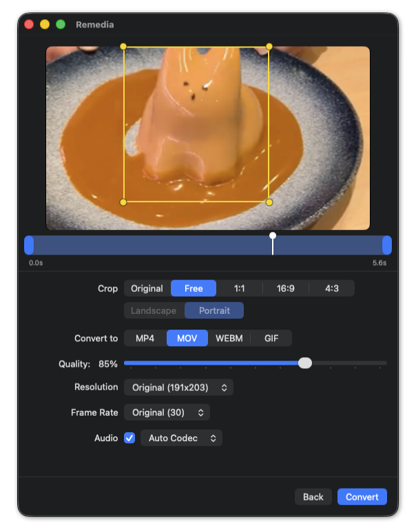

# Remedia


A native macOS app for converting media files between `.mp4`, `.mov`, `.webm`, and `.gif`.



## What it does

- Converts between `.mp4`, `.mov`, `.webm`, and `.gif`
- Crop (freeform or aspect-ratio presets) and trim before exporting
- Per-format output controls — quality, resolution, frame rate, palette/dither for gif
- Live preview while editing, for every source format including webm and gif
- Single-file workflow: drop a file, adjust settings, convert — no batch queue

## Why I build this

I needed a simple, offline macOS app to quickly convert my everyday media files without opening a web browser.

## Installation

1. Download the `.dmg` from [Releases](https://github.com/akexorcist/remedia-macos/releases), open it, and drag Remedia to Applications.
2. macOS blocks the app on first launch since it's unsigned. Open **System Settings → Privacy & Security**, scroll to the Remedia warning, and click **Open Anyway**.

## Requirements

- macOS (Apple Silicon)
- Xcode

## Building

```
xcodegen generate
open Remedia.xcodeproj
```

`RemediaCore` (the conversion engine) is a separate Swift package and can be tested on its
own via `swift test --package-path RemediaCore`.

## License

Apache License 2.0 — see [LICENSE](LICENSE).
